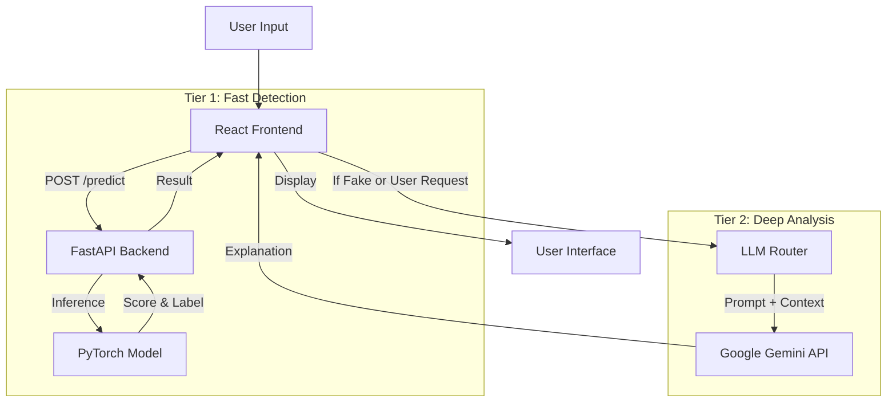

# System Architecture & Hybrid Intelligence Integration

## Overview

This document outlines the architecture for integrating the local **Misinformation Detection Model** with a **Large Language Model (LLM)** (like Google Gemini) to create a robust "Hybrid Intelligence" system.

## The "Hybrid Intelligence" Pattern

We use a two-tiered approach to balance **speed**, **cost**, and **depth**:

| Tier | Component | Role | Characteristics |
|------|-----------|------|-----------------|
| **Tier 1** | **Local ML Model** (PyTorch) | **Screening & Detection** | ⚡️ Ultra-fast (<50ms)<br>💰 Free (Local CPU)<br>🔒 Privacy-first<br>🎯 Specific Task (Fake/Real) |
| **Tier 2** | **LLM Agent** (Gemini/GPT) | **Analysis & Explanation** | 🧠 Deep Reasoning<br>💸 Higher Cost/Latency<br>🌐 Broad Knowledge<br>📝 Explains *WHY* |

## Integration Architecture



## Routing Logic

The application should decide *when* to call the expensive LLM based on the local model's output.

### 1. Automatic Routing (Confidence-Based)
If the local model is "unsure" (confidence between 40-60%), automatically escalate to the LLM for a second opinion.

```typescript
// Pseudo-code for Frontend Logic
const prediction = await localModel.predict(text);

if (prediction.confidence < 0.6 && prediction.confidence > 0.4) {
  // "Unsure" zone - Ask LLM automatically
  const analysis = await llmAgent.analyze(text);
  showHybridResult(prediction, analysis);
} else {
  // High confidence - Show local result immediately
  showLocalResult(prediction);
}
```

### 2. User-Initiated Routing (On-Demand)
Always show the local result first (instant feedback). Provide a "✨ Analyze with AI" button to get a detailed breakdown.

**Prompt Strategy for LLM:**
When calling the LLM, provide the local model's context to ground the response:

> **System Prompt:** "You are an expert fact-checker. A local ML model has flagged the following text as **{prediction}** with **{confidence}%** confidence. Analyze the text for logical fallacies, verify specific claims against your knowledge base, and explain *why* it might be misinformation."

## Data Flow

1.  **Input:** User pastes article text.
2.  **Local Inference:**
    *   Text is cleaned (regex, lowercase).
    *   TF-IDF Vectorizer converts to numbers.
    *   PyTorch model outputs probability (0.0 - 1.0).
3.  **Decision Point:**
    *   **IF** `confidence > 0.8`: Display "High Confidence" badge.
    *   **IF** `confidence < 0.6`: Suggest "Verify with Gemini".
4.  **LLM Enhancement (Optional):**
    *   User clicks "Explain".
    *   App sends text to LLM.
    *   LLM returns: "This article contains circular reasoning and cites non-existent studies..."
5.  **Presentation:** UI combines the *Score* (from Local ML) with the *Explanation* (from LLM).

## Future Improvements

-   **Feedback Loop:** Use LLM corrections to re-train the local model (Active Learning).
-   **Vector Database:** Store verified articles in a vector DB (RAG) to check if a similar story has already been debunked.
